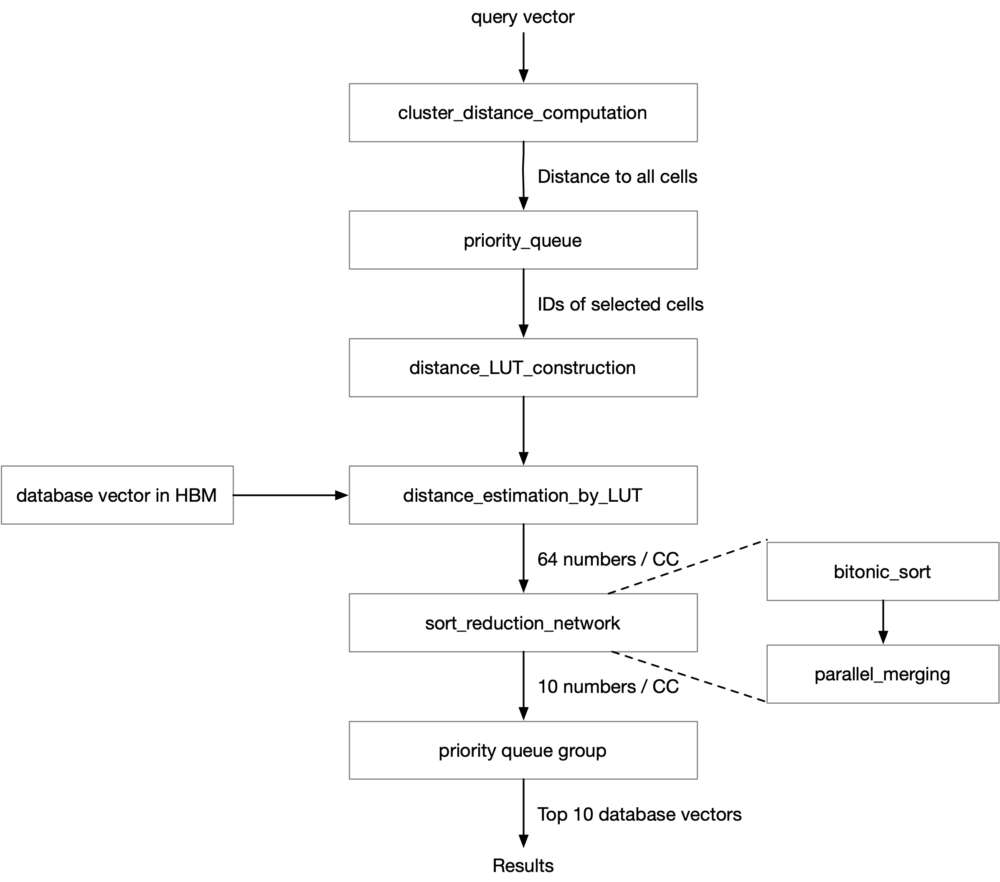
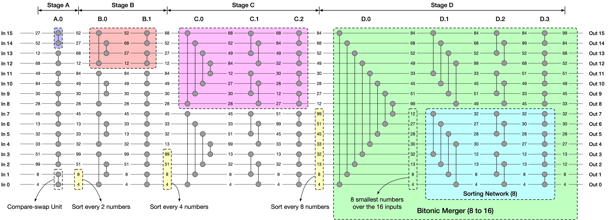

# PE_optimization

This folder is used for fine-tuning the performance and resource-utilization of each single PE of ANNS, including the following:

* cluster_distance_computation
* distance_LUT_construction
* distance_estimation_by_LUT
* bitonic_sort
* parallel_reduction_merge
* priority_queue
* sort_reduction_network


The high-level working flow of ANNS is as follow:



## folder structure

For each PE, there is a folder containing subfolders of different versions of implementations.

In each implementation, the source file is in src/vadd.cpp. There is a core PE function and a set of helper functions. We only need to evaluate the performance and resource consumption of the core PE function.

For each PE folder, there should be a README.md indicating the parameter settings (e.g., query number) and the HLS report on performance and resource consumption. So that we can compare different version of implementations.

### Build 

Vitis 2019.2 init: 

source /opt/Xilinx/Vitis/2019.2/settings64.sh

source /opt/xilinx/xrt/setup.sh

Build: 

make cleanall

time make check TARGET=sw_emu DEVICE=xilinx_u280_xdma_201920_3 VER=host_cpp

time make check TARGET=hw_emu DEVICE=xilinx_u280_xdma_201920_3 VER=host_cpp

time make check TARGET=hw DEVICE=xilinx_u280_xdma_201920_3 VER=host_cpp

For hardware emulation and hardware build, we can stop at the stage where HLS report is already generated. This should be finished when it appears "Run vpl: create_project: Started" in the log.

### Report directory

hw build:

vi _x.hw/vadd/reports/vadd.hw/hls_reports/vadd_csynth.rpt

hw emulation:

vi _x.hw_emu/vadd/reports/vadd.hw_emu/hls_reports/vadd_csynth.rpt 

### Copy folder

In order to make clear comparison between different version of implementation. We can use seperate folder for each version.

Instead of copying files manually, there's a script used for copying the src file and neglecting the generated build files. Usage:

```
mkdir ../version2
./cp_script ../version2
```


## cluster_distance_computation

The first step of ANNS.

Given the query vector (128-dimensional), compute the distance between the query vector and the cluster center vectors. 

In order to achieve high throughput, we use multiple PEs and each PE is responsible for a subset of computation. For example, suppose there are 8192 clusters, and there are 32 PEs, then each PE are responsible for computing 256 distances. The input vectors and output distances are streams.

The goal is to achieve > 20000 QPS (query per second) by using whatever the number of PE.

## distance_LUT_construction

Given the query vector and the center vectors of selected clusters, compute the distance LUT.

We use multiple PEs to improve throughput. For example, suppose there are 32 selected clusters to be scanned, and there are 4 PEs, then each PE are responsible for constructing 8 distance LUTs. The input vectors and output distance LUTs are streams.

The goal is to achieve > 20000 QPS (query per second) by using whatever the number of PE.

## distance_estimation_by_LUT

Given the input distance LUT and input PQ codes (compressed vectors), estimated the distance between the query vector and the database vectors.

We use multiple PEs to improve throughput. Here, the number of PE is fixed to 63. The reason is that we use 21 HBM channels to store database vectors, and in one clock cycle, 3 vectors can be loaded per channel. The AXI data width with HBM is 512 bit (64 bytes), and the storage format of each database vector is 16 byte PQ code + 4 byte vector ID (20 bytes per vector), thus the accelerator can load 3 vectors per channel per cycle. 

The reason we only use 21 HBM channel instead of all 32 is the limited resource on U280. Once we have all PEs, e.g., sort reduction network and priority queue and computation units, we wouldn't have enough resources to support such high input rate by using all 32 channels. This might be relieved by optimizing each single PE. 

This step should be the bottleneck of the entire flow. Our goal is to achieve performance as close as possible to the theoretical HBM bandwidth. 

Given an 100M dataset, if we cluster them into 8192 cells, and select 32 of the cells to perform search, and each the vectors of each cell is evenly distributed to 21 HBM channels, and each cycle 3 vectors can be read, then for each channel, it needs to perform 1e8 / 8192 * 32 / 21 / 3 = 6200 read operations. Suppose the frequency is 140 MHz, then the theoretical QPS is 1 / (6200 / 140 / 1e6) = 22580. However, this theoretical performance cannot be achieved due to (a) the random DRAM access when switching the cell to scan (b) the control logic overhead between queries and scanned cells (c) the initialization overhead to load distance LUT for every scanned cells (we might use double buffering, but currently we don't have that much resources). The overhead estimation is as below:
* For (a) each query initiate 32 random DRAM accesses, each of them takes ~300 ns according to our experience using Vitis and U280.
* For (b) control overhead, the number is unclear and might be optimzied (e.g., using a fixed query number instead of as a runtime parameter)
* For (c) for each cell to scan, it takes 256 cycles to load the distance LUT (K=256 is the fixed number of clusters for product quantizer) per scanned cell. 

As a result, the overhead per query (without control logic) = 32 * 300 * 1e-9 + 32 * 256 / 140 / 1e6 = 0.00006811428 s; 
The estimated performance after adding the overhead: 1 / (6200 / 140 / 1e6 + 32 * 300 * 1e-9 + 32 * 256 / 140 / 1e6) = 8896 QPS

## bitonic_sort

A deeply pipelined sorting network. Every cycle, the sorting network takes N inputs in parallel and output N sorted numbers of previous timestamps (the latency between input and output is related to N). Both inputs and outputs are streams.

Rather than serving as an independent module, the bitonic sort network is a building block to one PE that will be introduced later, i.e., sort_reduction_network.

Currently, the bitonic sort supports N <= 128. For larger N, HLS struggles to finish the array partition.

### Reference: *FLiMS: Fast Lightweight Merge Sorter*

This paper covers both bitonic sort & parallel merge.


Another usefule reference: 2010 Sorting Networks on FPGAs

### Map from figure to my code

I draw a version for bitonic sort 16: 



* Bitonic Sort 16
```
        // Stage A
        compare_swap_range_interval<16, 8>(input_array, out_stage1_0);   // A.0

        // Stage B: 2 -> 4
        compare_swap_range_head_tail<16, 4>(out_stage1_0, out_stage2_0); // B.0
        compare_swap_range_interval<16, 8>(out_stage2_0, out_stage2_1);  // B.1

        // Stage C: 4 -> 8
        compare_swap_range_head_tail<16, 2>(out_stage2_1, out_stage3_0); // C.0
        compare_swap_range_interval<16, 4>(out_stage3_0, out_stage3_1);  // C.1
        compare_swap_range_interval<16, 8>(out_stage3_1, out_stage3_2);

        // Stage D: 8 -> 16
        compare_swap_range_head_tail<16, 1>(out_stage3_2, out_stage4_0); // D.0
        compare_swap_range_interval<16, 2>(out_stage4_0, out_stage4_1);  // D.1
        compare_swap_range_interval<16, 4>(out_stage4_1, out_stage4_2);  // D.2
        compare_swap_range_interval<16, 8>(out_stage4_2, out_stage4_3);  // D.3
```

* Parallel merge (2 * 8 -> 8):
```
        // select the smallest 8 numbers
        compare_select_range_head_tail<8>(
            input_array_A, input_array_B, out_stage_0); // D.0

        // sort the selected numbers
        compare_swap_range_interval<8, 1>(out_stage_0, out_stage_1);  // D.1 lower half
        compare_swap_range_interval<8, 2>(out_stage_1, out_stage_2);  // D.2 lower half
        compare_swap_range_interval<8, 4>(out_stage_2, out_stage_3);  // D.3 lower half
```

* Extend to parallel merge (2 * 16 -> 16)
```
        // select the smallest 16 numbers
        compare_select_range_head_tail<16>(
            input_array_A, input_array_B, out_stage_0);

        // sort the selected numbers
        compare_swap_range_interval<16, 1>(out_stage_0, out_stage_1);
        compare_swap_range_interval<16, 2>(out_stage_1, out_stage_2);
        compare_swap_range_interval<16, 4>(out_stage_2, out_stage_3);
        compare_swap_range_interval<16, 8>(out_stage_3, out_stage_4);
```

## parallel_reduction_merge

Given 2 sorted streams, reduce the number by half and sort them. 

For example, the inputs are two stream arrays, each with a 16 width. The parallel reduction unit will first select the top 16 out of the total 32 number, then sort the 16 numbers and output them.

This is another building block for sort_reduction_network

## sort_reduction_network

This module is placed after distance_estimation_by_LUT, which outputs 64 estimated distances per cycle. The sort reduction network output the top 10 smallest distances per cycle. 

The sort reduction network consists of 2 parts: (a) 4 bitonic sort network with a width of 16 (b) a 2-level parallel merging tree.

(a) We partition the 64 inputs to 4 groups, and each group is sorted by a bitonic sort network with a width of 16.
(b) We use a 2-level paralle merging tree to reduce 64 numbers to 16. On the first level, there are 2 parallel merging modules, each takes 2 sets of 16 sorted number as input, and outputs the top 16 numbers. On the second level, there is 1 merging module to reduce the left 32 numbers to 16.s

Why using sort reduction network rather than a bitonic sort network taking in 64 numbers? We don't need a fully sorted array, but sorting all 64 numbers will consume extra hardware resoures than the sort reduction network which discards useless intermediate results.

## priority_queue

The priority queue here only supports push (no pop), and the numbers in the queue is not sorted. The inputs are streamed in, and after a certain number of iterations (assigend by us), all contents in the queue are sent out through a stream.

Currently, the performance of the queue is consuming 1 input number per 2 CC, no matter that is an insertion or not, because the queue is implemented in a systolic compare-swap manner.

There are two places in this project using priority queue. The first one after computing the distance between a query vector and all cell's centroids. It is used to select which cells to scan in. The second one is after sort_reduction_network, which outputs the distance to 10 closest database vectors every cycle. 20 priority queues with depth of 10 are used to match the data rate, and finally another one queue is used to collect the top 10 vectors from the 20 * 10 values after an entire query.
